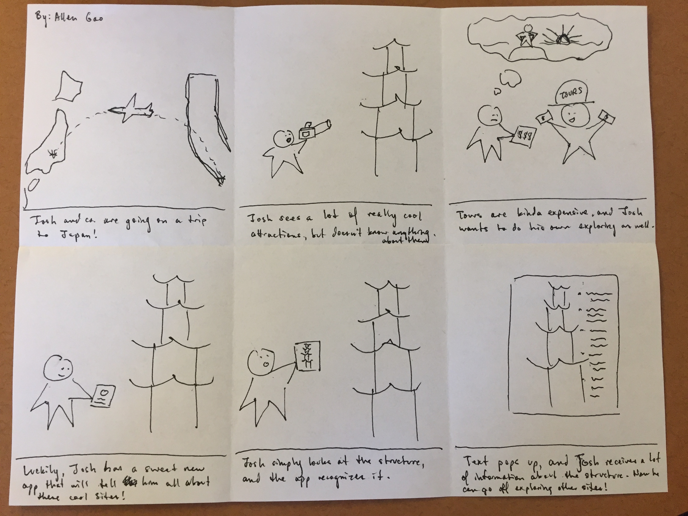
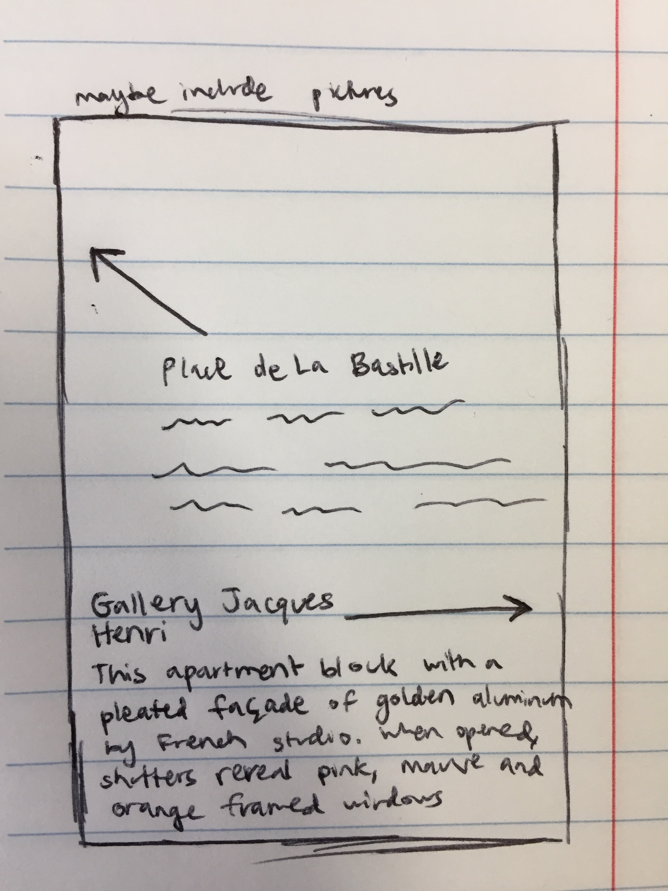

## Milestone 3

### Guorient - A New Way to Explore
Tour and discover places within a 100 ft. radius. Guorient literally points you to cool, hidden, and unique things in the world around you.

### Storyboard

This storyboard illustrates a need that our proposal would satisfy. This need would be for someone to explore the world around them and discover the most interesting locations and places that surround them, guorienting themselves along the best path to learning their surroundings.

### Feedback
* albertxp06 noted that "lots of attractions already have the information via some pamphlet, some plaque, or have someway to get to a website with digitized information" - we can make use of this by scraping the digitized information and incorporating it into our application.
* jphung11 commented that she would be "curious to see if the information would be from users or given/written by the app creators", and thinking about this, we decided that we would scrape the information for now.

### Features

* Arrows pointing to nearby attractions would be a feature portrayed by the sketch above.
* Brief tidbits on each attraction for the user to see if they're interested in the attraction.
* View relevant full information on each attraction (Yelp, Wikipedia, FB Page, hours, etc).

### Programming Work
* Allen - Incorporating augmented reality and compass directions
* Vincent - Streamlining user experience and ensuring smooth interface design
* Rishi - Scraping web/finding external data sources

